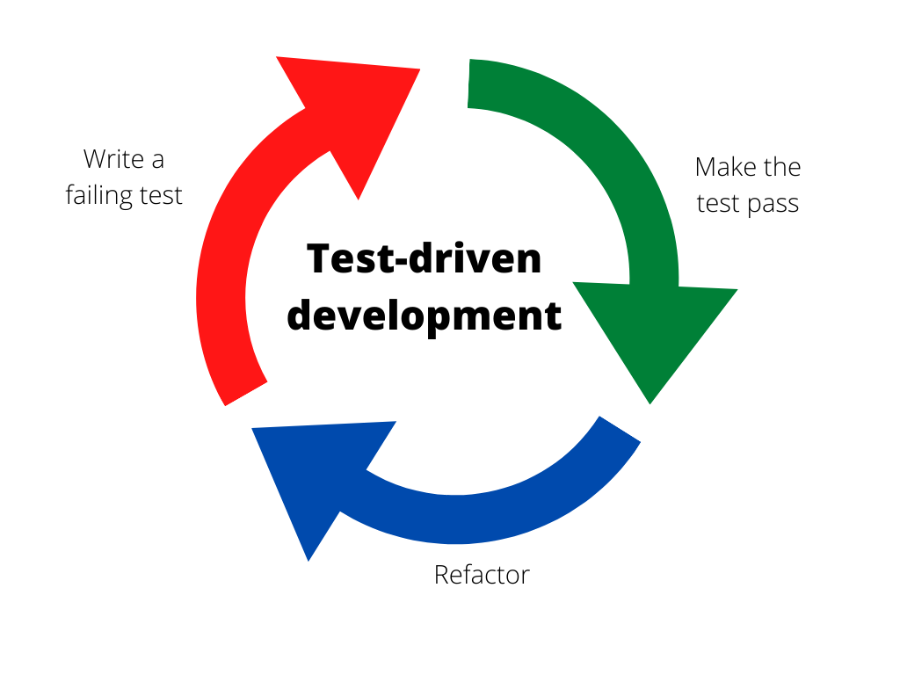

# Hello World

It's time to start writing your first Rust program. Is Rust installed on your machine? If the answer is no, install it following [the official guide](https://www.rust-lang.org/tools/install).

If it has been a while since you installed Rust, update to the latest version by running:

```bash
rustup update
```

It will update Rust to the latest stable version.


There's a new release of Rust **every 6 weeks**, so be sure to update to the latest version regularly.



[rustup](https://github.com/rust-lang/rustup/blob/master/README.md) allows you to easily switch between **beta, nightly and stable** versions. So, if you're excited about a new feature, don't hesitate to test it as soon as it is available in rustup.


## Create your first Rust project

The easiest way to create a new project is to use **Cargo**. Cargo is the Rust **build tool and package manager**. It does a lot of things for you including creating a new project. We will discover the power of Cargo along this series of exercices.

So, in order to create a new project, run:

```bash
cargo new hello-world
```

This will create a new folder with the following structure:

```console
hello-world
├── Cargo.toml
└── src
   └── main.rs
```

`main.rs` as you might have guessed is the entrypoint of your program. `Cargo.toml` is also called the *manifest* of your package. It generally consists of two main sections:

* **Information about your package** such as the author, the license and the version
* **Dependencies** that are necessary to compile the package

For now, yours should be pretty simple. By default, it contains basic info about the package and the dependencies section is empty.

So, now we have our environment set-up, let's write some code.

## Writing your first test

Remember, we are following test-driven development principles. So before running the code, we need to implement a test which is supposed to fail. Then, we will write the code to make the test pass and finally we will refactor our code as described in the illustration below.




During the refactoring phase, developers sometimes forget that it is an opportunity to refactor both your business logic and **your tests**. Tests are part of the code and should follow the same best practices like [KISS](https://en.wikipedia.org/wiki/KISS_principle) and [DRY](https://en.wikipedia.org/wiki/Don%27t_repeat_yourself). So, do not be lazy and refactor them if needed!


If you have been curious, you may have noticed that the code is already there in `main.rs`. But it is difficult to test it at the moment. Indeed, testing that the correct message is printed to your console when you run the program is hard. The call to `println!` is a side-effect. So, let's break the code into two functions. For now, our function won't return anything. Following the TDD principles, we will first write a test that fails.

```rust
fn say_hello() -> String {
    return "".to_string()
}

fn main() {
    println!("{}", say_hello());
}

#[cfg(test)]
mod tests {
    use super::*;

    #[test]
    fn test_say_hello() {
        assert!(say_hello() == "Hello, world!");
    }
}
```


Notice that we just created our first function. In Rust, you define functions using the keyword `fn`. Then, it is very similar to most languages. You need to use braces to tell the compiler where the body begins and where it ends. Also notice that we specified the type of the return value with a syntax that is very similar to type annotations in Python. If we had parameters, we would also have had to add the corresponding type.

To summarize, the syntax for defining a function in Rust is:

```rust
fn my_function(param1: u32, param2: bool) -> String {
    // function body
}
```



Time to execute our tests with Cargo. At the root of your `hello-world` folder, run:

```bash
cargo test
```

First, your code will be compiled and then, the test will be executed. As expected, the test fails.

Before trying to fix the code, let's have a look at the test syntax. A test in Rust is a function that's annotated with the `test` attribute. So, a test will always look like this:

```rust
#[test]
fn test_something() {
   // test logic
}
```

You will also need to import functions from the parent module with `use super::*` but let's leave that notion of module aside for now. We will cover it in a future section.

Ok, making this test pass shouldn't be too hard. Try to fix the function and reexecute the code. Your `say_hello` function should now looks like this:

```rust
fn say_hello() -> String {
    return "Hello, world!".to_string()
}
```

Time for a little clean-up!

Did you notice that when the test was failing, the error message did not mention what was the actual value vs what was expected? It's because we used the `assert!` macro that just evaluates if an expression is true. We can do better and use `assert_eq!` that will compare two expressions.


New to the word *macro*? No worries, we will cover them extensively in the rest of this book. Put it simply, macros are **a way of writing code that writes other code**. In Rust, they are easily identifiable thanks to the "!" at the end of their name.


After refactoring, your test should look like this:

```rust
#[test]
fn test_say_hello() {
   assert_eq!(say_hello(), "Hello, world!");
}
```

Try to make the test fail to see how the error is logged. Much better like that! Easier to debug!

## Conclusion and next steps

In this tutorial, we have seen how to create a new project and how to write tests and execute them. We also looked at the TDD cycle again to refresh our memory.

As a good exercise, you can try to make your program say hello to a person by passing the name of that person as an argument of the function. Don't forget to write the test first!

I hope you enjoyed this introduction! Coming up, data types!
